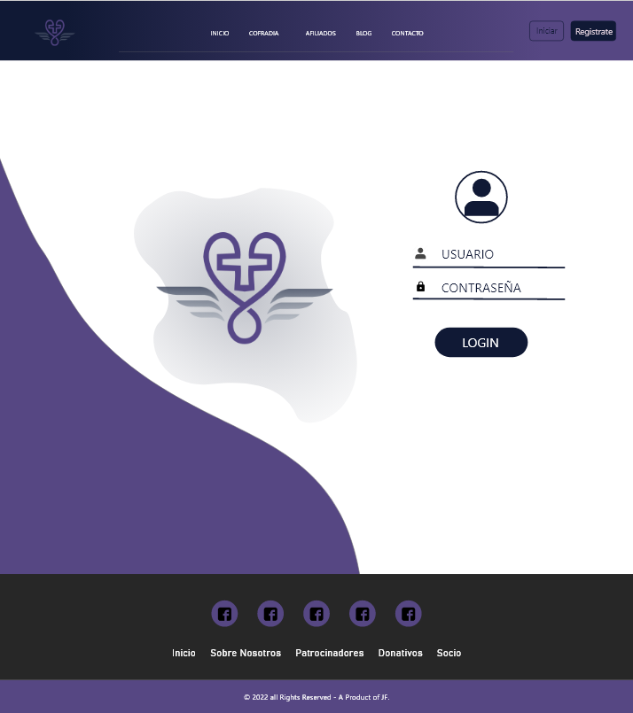

# Diseño De Interfaces Web

## Hermandad del Nazareno

<br><br>


   
<br><br>

[Juan Francisco Aguilar Sanchez](https://github.com/JuanFrancisco21)

12 de Diciembre de 2022                                      I.E.S Francisco de los Rios

<br>

## ÍNDICE

1. [Concepción](#id1)
2. [Diseño y Prototipo](#id2)
3. [Paleta de Colores](#id3)
4. [Futuras Mejoras](#id4)
5. [Accesibilidad](#id5)
6. [Usabilidad](#id6)
7. [Despliege](#id7)
7. [Licencia](#id8)
8. [Autor](#id9)

<br>

<!----------------------------- CONCEPCIÓN -------------------------------->

<a name="id1"></a>

# CONCEPCIÓN

Todo este proyecto comienza como una actividad para el grado superior DAW. Donde partimos del problema proporcionado por el profesor de crear una Página web basada en el color morado. Con la cual el mismo hizo una sugerencia de hacerla basada en una cofradia. Una vez que teníamos el problema planteado, comenzamos a trabajar en la solución.

Primero, hicimos una investigación sobre el color morado y su simbolismo en la cultura y la historia. Descubrimos que el color morado ha sido asociado con la realeza, la sabiduría y la espiritualidad en muchas culturas a lo largo de la historia. También encontramos que en muchas cofradías, el color morado se utiliza como símbolo de penitencia y humildad.

Con esta información en mente, decidimos enfocar nuestra página web en el simbolismo del color morado en la historia y en la cultura de las cofradías. Creamos un diseño atractivo y fácil de usar que destacaba el color morado y utilizaba imágenes y gráficos para ilustrar el simbolismo del color en diferentes contextos históricos y culturales.

Incluimos secciones en la página que hablaban sobre la historia de la Hermandad de nuestro Municipio, muchas de sus actividad y memorias ademas de cómo se utiliza el color en la actualidad. También agregamos una sección de recursos donde los visitantes podían encontrar enlaces a otros sitios web y recursos relacionados la cofradía.

Una vez planteado nuestro proyecto de la página web sobre la cofradía, desarrollar un prototipo de la página utilizando Adobe xd, un popular marco para desarrollo de prototipos, de código abierto que facilita la creación de sitios web responsivos y adaptables de manera agil.

Finalizando la web con tecnologias como principales tecnologias HTML5, SCSS Y BOOTSTRAP. Todo ello cumpliendo los estandares, tanto de accesibilidad como de usabilidad definidos por WCAG, realizando pruebas con la herramienta WAVE, a la par que comprobaciones con lectura de pantalla para personas con capacidad reducida, o el uso de heatmaps para comprobrar la usabilidad.

<br>

<!----------------------------- DISEÑO Y PROTOTIPO -------------------------------->
<a name="id2"></a>

# DISEÑO Y PROTOTIPO 


Una vez que decidimos que queríamos desarrollar un prototipo de la página web sobre la cofradía, necesitábamos una herramienta que nos permitiera diseñar y presentar el prototipo de manera efectiva. Después de investigar diferentes herramientas de diseño, decidimos utilizar Adobe XD, una aplicación de diseño de interfaz de usuario y experiencia de usuario (UX) de Adobe.

Utilizamos Adobe XD para diseñar el prototipo de la página web, creando diferentes pantallas y elementos de la interfaz de usuario. Utilizamos diferentes herramientas y funcionalidades de Adobe XD para dar forma a nuestro diseño y hacer que se vea atractivo y fácil de usar.

Una vez que completamos el diseño del prototipo, utilizamos Adobe XD para generar una presentación interactiva del prototipo. Esto nos permitió mostrar cómo la página web funcionaría en la práctica y cómo se vería en diferentes dispositivos y tamaños de pantalla.

Esta disponia de varias pantallas entre las cuales se encuentran las siguientes:

- # Página Inicio


<br>

- # Página Cofradia


<br>

- # Página Afiliados


<br>

- # Página Blog


<br>

- # Página Inicio Sesion / Registro


<br>

<!----------------------------- PALETA DE COLORES -------------------------------->

<a name="id3"></a>

# PALETA DE COLORES

Como partimos del color morado para la web de una cofradía. Utilizamos coolors.co para generar una paleta de colores que complemente al color morado.

Después de experimentar con diferentes combinaciones, decidimos que la mejor opción era combinar el morado con tonos de grises y azules. Esto le da un toque elegante y moderno a la web, además de reflejar la seriedad y solemnidad de la cofradía. Además, utilizamos el gris como color de fondo en la página de inicio para darle una sensación de estabilidad y equilibrio.

<br>


<br>

En algunas secciones utilizamos un tono más claro como para resaltar ciertos elementos y darles más importancia. En general, estamos muy contentos con el resultado final y creemos que la paleta de colores que hemos elegido es perfecta para la web de nuestra cofradía.

Una ventaja de coolors.co es la exportación de la paleta la cual te puedes descargar en un archivo txt con degradados y dichos colores en una gran variedad de formatos.

<br>


 <!----------------------------- FUTURAS MEJORAS -------------------------------->
<a name="id4" ></a>

# FUTURAS MEJORAS

Como es normal en una web siempre se puede mejorar o adaptar al estilo o gusto del dueño, por lo cual en este apartado se destacaran las futuras mejoras a implentar.

## Mejoras a implementar:

- Apartado de tienda para la compra-venta de productos de la cofradia.
- Creación de nueva página para la publicacíon de noticias.
- Mejorar la experiencia de los usuarios mediante la creación de un foro para solucionar dudas como tambien obtener feedback y retroalimentarnos del mismo.
- Mayor número de contenido multimedia, con el cual hacer más atractiva las diferentes páginas que componen nuestra web.
- Realizar un estudio y hacer avances en el posicionamiento de la web para diferenciarnos de las demás hermandades de la comarca
- Modelos 3d para la visualización de capaz como trajes de nazarenos y diversas prendas relacionadas con ello.
- Funciones Interactivas, para una mejor conexión entre los usuarios y la navegación con la cual sea mas amena dicha tarea.

<br>

<!----------------------------- ACCESIBILIDAD -------------------------------->
<a name="id5" ></a>

# ACCESIBILIDAD

## ESTANDARES WCAG:

Para la página web cumpla las Pautas de Accesibilidad al Contenido en la Web (WCAG), debe seguir estos pasos:

Asegurarse de que es perceptible, operable, comprensible y robustez. Esto significa garantizar que los usuarios puedan acceder a su sitio web y utilizarlo, independientemente de sus capacidades o discapacidades.

Asegurarse de que todo el texto de su sitio web pueda ser leído fácilmente por un lector de pantalla. Esto incluye utilizar un lenguaje claro y conciso, títulos y etiquetas adecuados y texto alternativo para las imágenes.

Ofrecer a los usuarios múltiples formas de navegar por su sitio web, como atajos de teclado y enlaces claros y descriptivos.

Cerciorarse de que todos los elementos de los formularios de su sitio web estén correctamente etiquetados y sean fáciles de usar. Esto incluye proporcionar instrucciones claras para rellenar los formularios y asegurarse de que todos los campos de los formularios están correctamente alineados y espaciados.

Como que cualquier contenido que se actualice o modifique en su sitio web se haga de forma accesible para los usuarios. Esto incluye proporcionar descripciones claras y concisas de cualquier cambio o actualización, y asegurarse de que los usuarios puedan acceder y utilizar fácilmente cualquier contenido nuevo.

En general, la clave para cumplir las normas WCAG en su sitio web es asegurarse de que sea accesible y utilizable para todos los usuarios, independientemente de sus capacidades o discapacidades. 

Siguiendo estos pasos anteriores, puede asegurarse de que la página web cumple estas normas y proporciona una experiencia agradable y accesible a todos los usuarios.

<br>

## PRUEBA WAVE:

Tras las pruebas realizadas con WAVE solo se han encontrado diversas alertas y ningun tipo de error. Esta alertas que se pueden encontrar son las siguientes:

- `Texto alternativo repetido` - Los adornos utilizados en los titulos de las secciones de las diferentes página que componen al proyecto. Una solucion que se daria seria cambiar el texto alternativo a la imagen diferenciando entre la inicial y la final.

- `Link redundante` - En el footer los botones de la aplicación whatsapp y Linkedin son el mismo, esto se debe a no querer publicar numeros de telefono privados. Esto se solucionaria cambiando el link a otra dirección.

- `Saltarse la estructuración de encabezados` - Los títulos estructuran el documento y facilitan la navegación con el teclado a los usuarios de tecnologías de apoyo. Estos usuarios pueden sentirse confusos o tener dificultades de navegación cuando se saltan los niveles de los encabezados.
Cómo solucionarlo. Reestructura los títulos del documento para evitar que se salten de nivel.

<br>

## PROBLEMAS ENCONTRADOS:
A la hora de crear un sitio web pueden surgir varios problemas:

- Diseñar un diseño fácil de usar y visualmente atractivo.
- Garantizar que el sitio web sea compatible con dispositivos móviles y responda a las necesidades de los usuarios.
- Adaptarse al prototipo para realizar un producto los más parecido y que no se desvarie del principal objetivo.
- Crear contenidos atractivos y útiles para el sitio web.
- Captar la esencia de una Cofradia con el color morado.


<br>

<!----------------------------- USABILIDAD -------------------------------->
<a name="id6" ></a>

# USABILIDAD

## PRINCIPIOS PERSEGUIDOS:

Hay varios principios de usabilidad que suelen utilizarse en la creación de un sitio web. Estos principios pueden ayudar a garantizar que el sitio web sea fácil de usar y navegar, y que proporcione una experiencia de usuario positiva. Los mas remarcables empleados son los siguientes:

 1. `Simplicidad`: Un sitio web debe diseñarse de forma sencilla e intuitiva, para que los usuarios puedan encontrar fácilmente lo que buscan. Esto puede conseguirse utilizando un lenguaje claro y conciso, un diseño limpio y despejado y una navegación fácil de usar.

2. `Coherencia`: Un sitio web debe utilizar elementos de diseño coherentes, como fuentes, colores y diseño, en todo el sitio. Esto ayuda a crear un aspecto cohesivo y unificado, y facilita a los usuarios la navegación por el sitio.

3. `Flexibilidad`: Un sitio web debe ser flexible y adaptable, de modo que pueda utilizarse fácilmente en diversos dispositivos, como ordenadores de sobremesa, portátiles, tabletas y teléfonos inteligentes. Esto puede lograrse mediante el uso de técnicas de diseño responsivo que ajustan automáticamente el diseño del sitio para adaptarse al tamaño y la forma del dispositivo del usuario.

4. `Accesibilidad`: Un sitio web debe ser accesible para usuarios con discapacidad, como los ciegos o los que tienen baja visión, problemas auditivos o de movilidad. Esto puede lograrse mediante el uso de técnicas de diseño accesibles, como proporcionar alternativas de texto para imágenes y vídeos, utilizar texto descriptivo en los enlaces y emplear encabezados y una estructura adecuados para facilitar la navegación por el contenido.

5. `Diseño centrado en el usuario`: Un sitio web debe diseñarse teniendo en cuenta las necesidades y preferencias del público destinatario. Esto puede conseguirse mediante la investigación y las pruebas con usuarios, para recabar opiniones de usuarios reales y asegurarse de que el sitio satisface sus necesidades y expectativas.

<br>

## TEST Y HEATMAP:

Los mapas de calor se utilizan a menudo en los sitios web para visualizar el comportamiento de los usuarios e identificar las áreas de un sitio web que atraen la mayor atención. Esta información puede ser útil para los diseñadores y vendedores de sitios web, ya que puede ayudarles a entender qué contenido de un sitio web es más interesante para los usuarios, y qué áreas del sitio web pueden necesitar ser rediseñadas o mejoradas.

Los mapas de calor suelen crearse siguiendo los movimientos del cursor, los clics y el comportamiento de desplazamiento de los usuarios en un sitio web, y utilizando estos datos para crear una representación visual de los lugares en los que los usuarios pasan más tiempo. El mapa de calor resultante suele mostrar las zonas de un sitio web que reciben más atención, así como las zonas que se ignoran o infrautilizan.

Con un mapa de calor, los diseñadores y vendedores de sitios web pueden identificar patrones en el comportamiento de los usuarios que pueden no ser evidentes a primera vista, y utilizar esta información para mejorar el diseño general y la experiencia de usuario de un sitio web. Por ejemplo, un mapa de calor puede mostrar que un botón o enlace concreto de un sitio web se pulsa con más frecuencia que otros, lo que indica que es un elemento importante del sitio web que debería destacarse o enfatizarse. Por otra parte, un mapa de calor puede revelar que los usuarios ignoran determinadas zonas de un sitio web, lo que indica que es necesario rediseñarlas o eliminarlas.

En resumen, los mapas de calor son herramientas útiles para comprender el comportamiento de los usuarios en los sitios web, y pueden utilizarse para mejorar el diseño y la experiencia de usuario de un sitio web. Por ello se han realizados dichos test a 5 individuos diferentes:

Fotos que se adjuntan en la carpeta assets/Heatmap.

<br>

<!----------------------------- DESPLIEGE -------------------------------->
<a name="id8" ></a>

# DESPLIEGE

Todo el código esta almacenado en un repositorio privado en [Github](https://github.com/JuanFrancisco21)
, y desplegado en aws con dns [wordjagusan.duckdns.org](http://wordjagusan.duckdns.org) .

## Gulp para el despliege:

Gulp es una herramienta que puede ayudar a automatizar muchas de las tareas implicadas en el desarrollo web, como la optimización de imágenes, la compilación de CSS , JavaScript y la ejecución de pruebas. Usar gulp puede ahorrar mucho tiempo y hacer que el flujo de trabajo de desarrollo web sea más eficiente. 

Además, gulp permite utilizar plugins para realizar tareas aún más complejas, como minificar tu código o manejar una maquina virtual alojada en Amazon Web Service. En general, el uso de gulp en el proyecto ayudar a mejorar la productividad y agilizar su flujo de trabajo.

Por eso se disponen de 4 tareas en el archivo gulpfile:

## Tareas:

### COMPILAR SASS

Para compilar Sass con gulp, primero necesitarás instalar gulp y el plugin gulp-sass en tu proyecto. Puedes hacerlo ejecutando los siguientes comandos:

```
npm install gulp gulp-sass --save-dev
```

Una vez que hayas instalado estas dependencias, puedes crear una tarea gulp para compilar tus archivos Sass añadiendo el siguiente código a tu gulpfile.js:

```
const gulp = require('gulp');
const sass = require('gulp-sass');

gulp.task('sass', function () {
  return gulp.src('src/styles/*.scss')
    .pipe(sass())
    .pipe(gulp.dest('dist/css'));
});
```

Esta tarea de gulp buscará todos los archivos con extensión .scss en el directorio src/styles, los compilará usando el plugin gulp-sass, y mostrará los archivos CSS resultantes en el directorio dist/css.

Para ejecutar esta tarea, puede utilizar el siguiente comando:

```
gulp sass
```

<br>

### COMPILAR SASSDOC

En este ejemplo, la tarea sassdoc compilará la documentación Sassdoc para todos los archivos con extensión .scss en el directorio path/to/sass/files. Puede ajustar las rutas de entrada y salida según sea necesario para su proyecto.

```
const gulp = require('gulp');
var exec = require('child_process').exec;

function compiles_sass_doc(cb) {
    exec('sassdoc ./assets/scss/partials  -d ./documentacion/sassdoc/', function (err, stdout, stderr) {
        console.log(stdout);
        console.log(stderr);
        cb(err);
    });
}

exports.sassdoc = compiles_sass_doc;

```

Para ejecutar esta tarea, puede utilizar el siguiente comando:

```
gulp sassdoc
```

### DESPLIEGE EN AWS
Esta misma se divide en dos tareas las cuales se ejecturan en serie o en paralelo y estas tareas son dos:

Antes de crear dichas tareas se necesita de un plugin para la conexion ssh a nuesta maquina aws, de la siguiente manera:

```
var gulp = require('gulp');
var ssh = require('gulp-ssh');

var config = {
  host: 'hostname',
  port: 22,
  username: 'username',
  password: 'password'
}

var gulpSSH = new ssh({
  ignoreErrors: false,
  sshConfig: config
});
```

La primera de las dos tareas consiste en la descarga de la version mas actualizada del proyecto que esta almacenado en un repositorio de github:
```
/**
 * Mover puntero a la carpesa asociada al repositorio y hacer un pull.
 * @returns Devuelve por consola una respuesta de tarea completada o un error.
 */
function download_git_data() {
    return gulpSSH
    .exec([ 'git -C environment/Containers/wishlist/HTML5-Hermandad-del-nazareno/ pull ']);
}
```

Y finalizando con la funcion la cual inicia el contenedor de docker con apache para mostranos la página web principal:
```
/**
 * Inicia el contenedor que muestra la página web de la hermandad.
 * @returns Devuelve por consola una respuesta de tarea completada o un error.
 */
function start_container(){
    return gulpSSH
    .exec(['docker start hermandad']);
}
```

Para ejecutar esta tarea, puede utilizar cualquiera de los siguientes comandos:

```
/* Nombres de exportación de las funciones */
exports.update_container=download_git_data;
exports.start_container=start_container;

exports.toDo = series(start_container, download_git_data);


gulp update                ( Tarea1 )
gulp start_container       ( Tarea2 )
gulp toDo                  ( Tarea1 y Tarea2)
```

<br>


<br>

## Bajo los siguientes términos:

- `Atribución` - Debe dar el crédito apropiado, proporcionar un enlace a la licencia e indicar si se hicieron cambios. Puede hacerlo de cualquier forma razonable, pero no de ninguna manera que sugiera que el licenciante lo respalda a usted o a su uso.

- `No comercial` - No puede utilizar el material con fines comerciales.

- `CompartirIgual` - Si usted remezcla, transforma o construye sobre el material, debe distribuir sus contribuciones bajo la misma licencia que el original.

- `Sin restricciones adicionales` - No puede aplicar términos legales o medidas tecnológicas que restrinjan legalmente a otros de hacer cualquier cosa que la licencia permita.

<br>


<!----------------------------- LICENCIA -------------------------------->
<a name="id8" ></a>

# LICENCIA

## Usted es libre de:

- Compartir - copiar y redistribuir el material en cualquier medio o formato
- Adaptar - remezclar, transformar y construir sobre el material
- El licenciante no puede revocar estas libertades siempre que se respeten los términos de la licencia.

<br>

## Bajo los siguientes términos:

- `Atribución` - Debe dar el crédito apropiado, proporcionar un enlace a la licencia e indicar si se hicieron cambios. Puede hacerlo de cualquier forma razonable, pero no de ninguna manera que sugiera que el licenciante lo respalda a usted o a su uso.

- `No comercial` - No puede utilizar el material con fines comerciales.

- `CompartirIgual` - Si usted remezcla, transforma o construye sobre el material, debe distribuir sus contribuciones bajo la misma licencia que el original.

- `Sin restricciones adicionales` - No puede aplicar términos legales o medidas tecnológicas que restrinjan legalmente a otros de hacer cualquier cosa que la licencia permita.

<br>

<!----------------------------- AUTOR -------------------------------->
<a name="id9" ></a>

# AUTOR

[Juan Francisco Aguilar Sanchez](https://github.com/JuanFrancisco21)

<br>
<br>

<a rel="license" href="http://creativecommons.org/licenses/by-nc-sa/4.0/"></a><br />Este obra está bajo una <a rel="license" href="http://creativecommons.org/licenses/by-nc-sa/4.0/">licencia de Creative Commons Reconocimiento-NoComercial-CompartirIgual 4.0 Internacional</a>.

<br>
